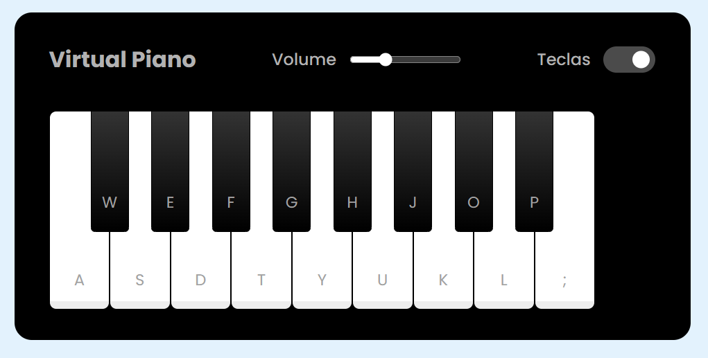

# Mini Piano Simulator

Um simulador de piano virtual feito com HTML, CSS e JavaScript, permitindo aos usuários tocar notas através de teclas do teclado ou clicando nas teclas na tela. O projeto também oferece controle de volume e a opção de esconder ou mostrar as teclas.

## Piano Simulator Screenshot

## Funcionalidades

- **Teclas Interativas**: Toque as teclas do piano clicando sobre elas ou utilizando as teclas do teclado
- Teclas -> (`a, w, s, e, d, f, t, g, y, h, u, j, k, l, ;`).
- **Controle de Volume**: Ajuste o volume do som utilizando o controle deslizante na interface.
- **Mostrar/Ocultar Teclas**: Controle a visibilidade das teclas do piano com um simples clique.

## Tecnologias Usadas

- **HTML5**: Estruturação do conteúdo da página.
- **CSS3**: Estilização da interface.
- **JavaScript**: Lógica de funcionamento para tocar as notas e interagir com o usuário.
- **Áudio**: Sons de notas de piano em formato `.wav` para tocar as notas.
